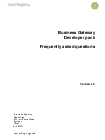

## frequently asked questions

### Technical terms and conveyancing terms used within the Developer Pack.

#### Documents
<h3>
<a href="../../pdfs/definitions/business-gateway-FAQ.pdf">Frequently asked questions</a></h3>
<a download="business-gateway-FAQ.pdf" href="../../pdfs/definitions/business-gateway-FAQ.pdf">Download</a>

PDF, 417KB, 10 pages

#### Details
Commonly asked questions about developing an interface to Land Registry’s Business Gateway.