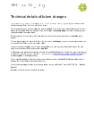

## Technical guidance for infrastructure change
### Guidance for web developers to help integrate changes to the Business Gateway infrastructure into their software.
#### Documents
<h3>
<a href="../../pdfs/integrate/Technical_details_of_change.pdf">Technical details of change</a></h3>
<a download="Technical_details_of_change.pdf" href="../../pdfs/integrate/Technical_details_of_change.pdf">Download</a>

PDF, 59KB, 3 pages
 
 
 
#### Details
This document is intended for software developers using our web services. It should help them to test their interface with the web services before deploying software to use the production business gateway.