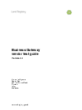

## vendor testing guide
### Guidance for software developers that are using Land Registry web services and testing an interface with these services.
#### Documents
<h3>
<a href="../../pdfs/integrate/business-gateway-vendor-test-guide.pdf">Vendor testing guide</a></h3>
<a download="business-gateway-vendor-test-guide.pdf" href="../../pdfs/integrate/business-gateway-vendor-test-guide.pdf">Download</a>

PDF, 152KB, 8 pages
 
 
 
#### Details
This document is intended for software developers using Land Registry web services. It should assist them to test their interface with the web services before deploying software to use the production business gateway.