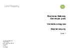

## Daylist Enquiry

### Technical documents for software developers to integrate Daylist Enquiry service data into their systems.

#### Contents
- [Process flow](#process-flow)
- [Schemas](#schemas)
- [Vendor testing](#vendor-testing)

Reveals any pending applications that are lodged against the title.

### Process flow

#### Input
Request a daylist enquiry by sending the following parameters:

- login details
- external reference number
- title number

The following parameters will also be necessary if there are any complications, and may be supplied to keep transaction calls and processing times to a minimum.

- continue if title is closed and continued

#### Validation
Validation diagram details the validation that the request undergoes.

<h3>
<a href="../../pdfs/services/DaylistEnquiry_ValidationDiagram_v1.1.pdf">Validation diagram</a></h3>
<a download="DaylistEnquiry_ValidationDiagram_v1.1.pdf" href="../../pdfs/services/DaylistEnquiry_ValidationDiagram_v1.1.pdf">Download</a>

PDF, 141KB, 3 page
 
#### Output
A list of entries found against the supplied title number.

### Schemas

<h3> 
<a href="../../schemas/RequestDaylistEnquiryV2_0.xsd">RequestDaylistEnquiryV2_0.xsd</a></h3>
<a download="RequestDaylistEnquiryV2_0.xsd" href="../../schemas/RequestDaylistEnquiryV2_0.xsd">Download</a>

XSD, 7KB

 
<h3> 
<a href="../../schemas/ResponseDaylistEnquiryV2_0.xsd">ResponseDaylistEnquiryV2_0.xsd</a></h3>
<a download="ResponseDaylistEnquiryV2_0.xsd" href="../../schemas/ResponseDaylistEnquiryV2_0.xsd">Download</a>

XSD, 23KB

 

<h3>
<a href="../../pdfs/services/DaylistEnquiry_v2.0_SchemaExplain.pdf">Schema explain</a></h3>
<a download="DaylistEnquiry_v2.0_SchemaExplain.pdf" href="../../pdfs/services/DaylistEnquiry_v2.0_SchemaExplain.pdf">Download</a>

PDF, 203KB, 8 pages

#### Schema explain describes the request schema for the service.

### Vendor testing

#### Documents the data required for testing the service.

<h3>
<a href="../../pdfs/services/DaylistEnquiry v2_0VendorTest.pdf">Vendor Test Data</a></h3>
<a download="DaylistEnquiry v2_0VendorTest.pdf" href="../../pdfs/services/DaylistEnquiry v2_0VendorTest.pdf">Download</a>

PDF, 206KB, 6 pages