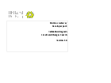

## Local Land Charges Search

### Technical documents for software developers to integrate Local Land Charges Search service data into their systems.

#### Contents
- [Process flow](#process-flow)
- [Schemas](#schemas)
- [Vendor testing](#vendor-testing)

The Local Land Charges Search service identifies any Local Land Charges which effect the area identified by the search request.

### Process flow

#### Validation
Local Land Charges Search service validation diagram details the validation that the request goes through.

<h3>
<a href="../../pdfs/services/LLC_Validation_Diagram_V2_0.pdf">Validation diagram</a></h3>
<a download="LLC_Validation_Diagram_V2_0.pdf" href="../../pdfs/services/LLC_Validation_Diagram_V2_0.pdf">Download</a>

PDF, 132KB, 4 pages
 

### Schemas

<h3> 
<a href="../../schemas/LLCSearchRequestV2_0.xsd">LLCSearchRequestV2_0.xsd</a></h3>
<a download="LLCSearchRequestV2_0.xsd" href="../../schemas/LLCSearchRequestV2_0.xsd">Download</a>

XSD, 4KB

 
<h3> 
<a href="../../schemas/LLCSearchResponseV2_0.xsd">LLCSearchResponseV2_0.xsd</a></h3>
<a download="LLCSearchResponseV2_0.xsd" href="../../schemas/LLCSearchResponseV2_0.xsd">Download</a>

XSD, 16KB

 
<h3> 
<a href="../../schemas/PollRequest.xsd">PollRequest.xsd</a></h3>
<a download="PollRequest.xsd" href="../../schemas/PollRequest.xsd">Download</a>

XSD, 3B

 

<h3>
<a href="../../pdfs/services/LLC_Interface_Spec_V2_0.pdf">Interface specification</a></h3>
<a download="LLC_Interface_Spec_V2_0.pdf" href="../../pdfs/services/LLC_Interface_Spec_V2_0.pdf">Download</a>

PDF, 606KB, 36 pages
 
 
 
The interface specification specifies the interface between Land Registry and a Business Gateway Register Extract Service customer.

### Vendor testing

#### Documents the data required for testing the service.

<h3>
<a href="../../pdfs/services/LLC_Vendor_test_data_V2_0.pdf">Vendor Test Data</a></h3>
<a download="LLC_Vendor_test_data_V2_0.pdf" href="../../pdfs/services/LLC_Vendor_test_data_V2_0.pdf">Download</a>

PDF, 252KB, 14 pages