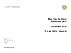

## Outstanding requests service

### Technical documents for software developers to integrate Outstanding Requests Service data into their systems.

Returns a list of requests that have responses available. These responses can then be retrieved using the Poll Request Service. More information is availble in Outstanding Requests Service Information below.

### Service Information

<h3>
<a href="../../pdfs/services/Outstanding_Requests_Service_Info.pdf">Outstanding requests service information</a></h3>
<a download="Outstanding_Requests_Service_Info.pdf" href="../../pdfs/services/Outstanding_Requests_Service_Info.pdf">Download</a>

PDF, 157KB, 2 pages

### Schemas

<h3> 
<a href="../../schemas/RequestOutstandingRequestsV2_1.xsd">RequestOutstandingRequestsV2_1.xsd</a></h3>
<a download="RequestOutstandingRequestsV2_1.xsd" href="../../schemas/RequestOutstandingRequestsV2_1.xsd">Download</a>

XSD, 5KB

 
<h3> 
<a href="../../schemas/ResponseOutstandingRequestsV2_0.xsd">Schema: ResponseOutstandingRequestsV2_0.xsd</a></h3>
<a download="ResponseOutstandingRequestsV2_0.xsd" href="../../schemas/ResponseOutstandingRequestsV2_0.xsd">Download</a>

XSD, 8KB

 

<h3>
<a href="../../pdfs/services/OutstandingRequestsServiceSchemaExplain.pdf">Schema explain</a></h3>
<a download="OutstandingRequestsServiceSchemaExplain.pdf" href="../../pdfs/services/OutstandingRequestsServiceSchemaExplain.pdf">Download</a>

PDF, 47KB, 4 pages

#### Schema explain describes the request schema for the service.

### Vendor testing

#### Vendor Test Data (Outstanding requests) documents the data for testing the service.

<h3>
<a href="../../pdfs/services/Outstanding_Requests_v2.1_VendorTest.pdf">Vendor Test Data</a></h3>
<a download="Outstanding_Requests_v2.1_VendorTest.pdf" href="../../pdfs/services/Outstanding_Requests_v2.1_VendorTest.pdf">Download</a>

PDF, 238KB, 5 pages