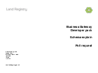

## Poll request service

### Technical documents for software developers to integrate Poll Request service data into their systems.

Returns the response for the given message ID.

### Schemas

<h3> 
<a href="../../schemas/PollRequest.xsd">PollRequest.xsd</a></h3>
<a download="PollRequest.xsd" href="../../schemas/PollRequest.xsd">Download</a>

XSD, 5KB

 

<h3>
<a href="../../pdfs/services/PollRequest_Schema_Explain.pdf">Schema explain</a></h3>
<a download="PollRequest_Schema_Explain.pdf" href="../../pdfs/services/PollRequest_Schema_Explain.pdf">Download</a>

PDF, 125KB, 2 pages

#### Schema explain describes the request schema for the service.
