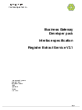

## Register Extract Service

### Technical documents for software developers to integrate Register Extract Service (RES) service data into their systems.

#### Contents
- [Schemas](#schemas)
- [Vendor testing](#vendor-testing)

Delivers an extract of the data available in the Official Copy document as part of the XML stream.

### Schemas

<h3> 
<a href="../../schemas/RequestOCWithSummaryV2_0.xsd">RequestOCWithSummaryV2_0.xsd</a></h3>
<a download="RequestOCWithSummaryV2_0.xsd" href="../../schemas/RequestOCWithSummaryV2_0.xsd">Download</a>

XSD, 14KB

 
<h3> 
<a href="../../schemas/ResponseOCWithSummaryV2_1.xsd">ResponseOCWithSummaryV2_1.xsd</a></h3>
<a download="ResponseOCWithSummaryV2_1.xsd" href="../../schemas/ResponseOCWithSummaryV2_1.xsd">Download</a>

XSD, 70KB

 

<h3>
<a href="../../pdfs/services/RES_V2_1_Interface_Specification.pdf">Interface specification</a></h3>
<a download="RES_V2_1_Interface_Specification.pdf" href="../../pdfs/services/RES_V2_1_Interface_Specification.pdf">Download</a>

PDF, 798KB, 64 pages
 
 
 
The interface specification specifies the interface between Land Registry and a Business Gateway Register Extract Service customer.

### Vendor testing

#### Documents the data required for testing the service.

<h3>
<a href="../../pdfs/services/RES_Vendor_Data_v1.2.pdf">Vendor Test Data</a></h3>
<a download="RES_Vendor_Data_v1.2.pdf" href="../../pdfs/services/RES_Vendor_Data_v1.2.pdf">Download</a>

PDF, 181KB, 5 pages